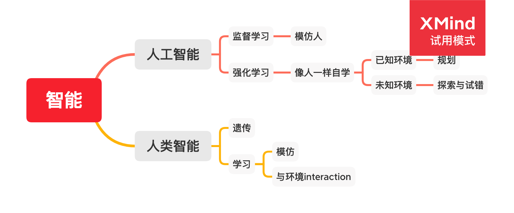
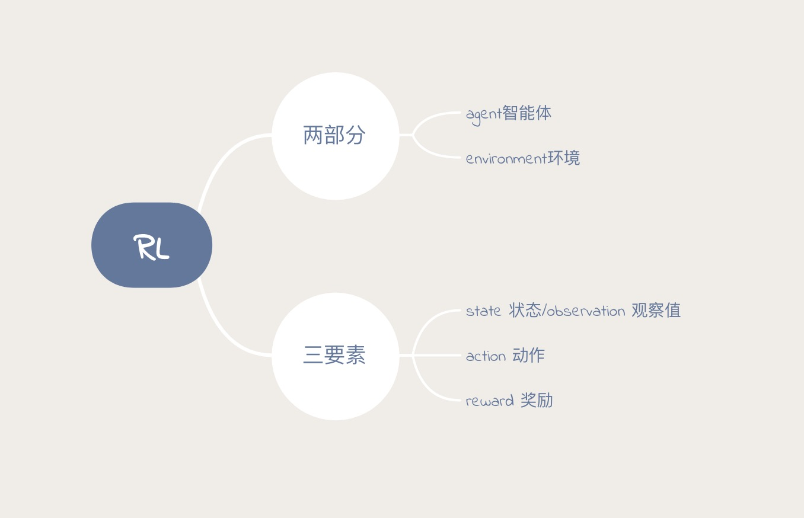
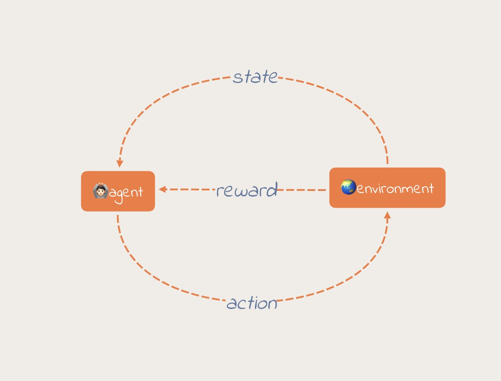
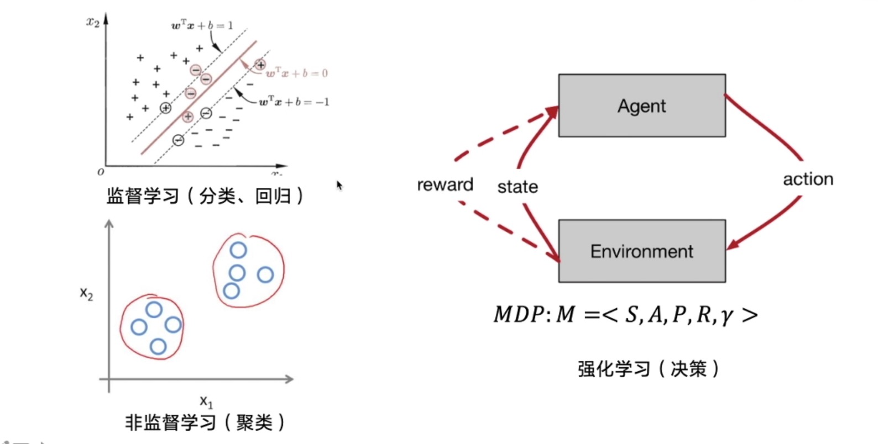
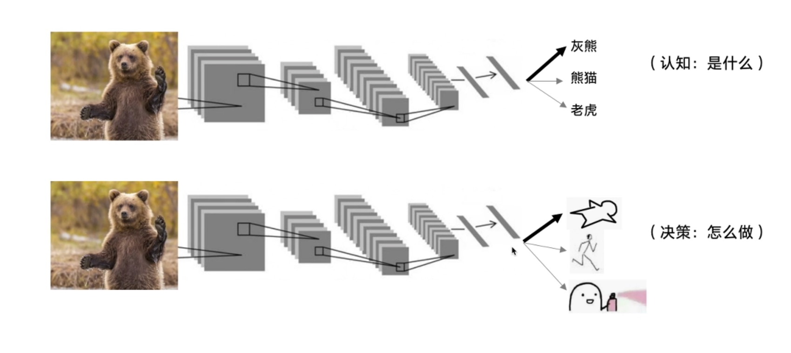
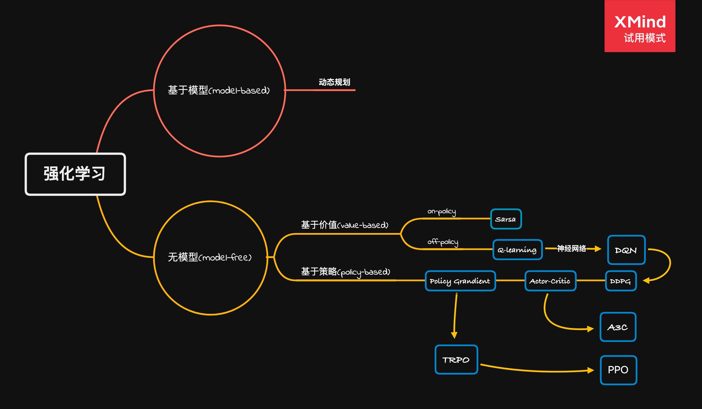

## 强化学习

### 核心思想
智能体Agent在环境environment中学习，根据环境的状态state，执行动作action，并根据环境的反馈reward来指导更好的动作。

如下图所示：

强化学习是一个序列决策的过程。过程中不断与环境进行交互，然后输出观察和动作。

强化学习的特点：
1. 不断与环境交互
2. 奖励延迟。不会知道每一步做的对不对，只有完成一系列的动作才知道是否成功。

强化学习与其他机器学习不同的地方

强化学习与监督学习的区别

监督学习的训练样本类型是相同的，强化学习训练的样本是不同的。上一个样本的结果对下一个样本的训练是有影响的。

### Agent学习的两种方案
1. 基于价值
2. 基于策略

